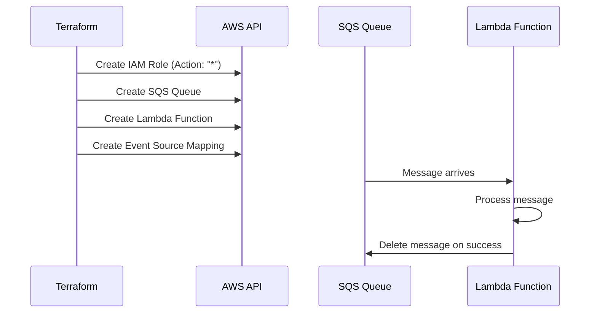
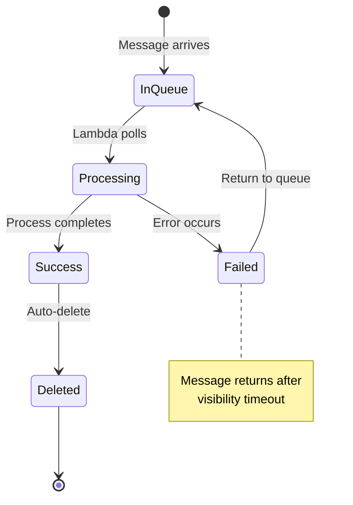

# Design Document: Lambda SQS Processor

## Overview

This design specifies an AWS Lambda function that processes messages from an SQS queue. The architecture intentionally uses overly-permissive IAM policies (Action: "*", Resource: "*") to demonstrate zero-trust policy violations and blast radius analysis. This serves as an educational example of insecure infrastructure before remediation to least-privilege permissions.

The system consists of:
- An AWS Lambda function with Python 3.11 runtime
- An SQS queue that triggers the Lambda function
- An IAM execution role with full AWS permissions (intentionally insecure)
- CloudWatch Logs for execution monitoring
- Event source mapping to connect SQS to Lambda

All infrastructure is defined in Terraform and deployed to us-east-1.

## Architecture

### Component Diagram

```mermaid
graph LR
    SQS[SQS Queue] -->|Event Source Mapping| Lambda[Lambda Function]
    Lambda -->|Assumes| Role[IAM Execution Role]
    Lambda -->|Writes Logs| CW[CloudWatch Logs]
    Role -->|Grants| Perms[Action: "*"<br/>Resource: "*"]
    
    style Perms fill:#ff6b6b,stroke:#c92a2a,color:#fff
    style Role fill:#ffd43b,stroke:#fab005
```

### Deployment Flow



### Security Posture (Intentionally Insecure)

This design **intentionally violates** zero-trust principles:

- ❌ **IAM-001 CRITICAL**: Wildcard action (`Action: "*"`)
- ❌ **IAM-002 CRITICAL**: Wildcard resource (`Resource: "*"`)
- ⚠️ **Blast Radius**: CRITICAL - Full AWS account access

The execution role can perform **any action on any resource** in the AWS account, including:
- Deleting production databases
- Modifying IAM policies
- Exfiltrating data from S3 buckets
- Terminating EC2 instances
- Creating new admin users

## Components and Interfaces

### 1. Lambda Function

**Resource Type**: `aws_lambda_function`

**Configuration**:
- **Function Name**: `sqs-message-processor`
- **Runtime**: `python3.11`
- **Handler**: `index.handler`
- **Memory**: 256 MB
- **Timeout**: 60 seconds
- **Role**: References the execution role ARN

**Handler Interface**:
```python
def handler(event, context):
    """
    Process SQS messages.
    
    Args:
        event: SQS event containing Records array
        context: Lambda context object
        
    Returns:
        dict: Processing result with statusCode and body
    """
    pass
```

**Event Structure**:
```json
{
  "Records": [
    {
      "messageId": "string",
      "receiptHandle": "string",
      "body": "string",
      "attributes": {},
      "messageAttributes": {},
      "md5OfBody": "string",
      "eventSource": "aws:sqs",
      "eventSourceARN": "arn:aws:sqs:us-east-1:123456789012:queue-name",
      "awsRegion": "us-east-1"
    }
  ]
}
```

### 2. SQS Queue

**Resource Type**: `aws_sqs_queue`

**Configuration**:
- **Queue Name**: `message-processing-queue`
- **Visibility Timeout**: 300 seconds (5 minutes, must be ≥ Lambda timeout)
- **Message Retention**: 345600 seconds (4 days)
- **Receive Wait Time**: 0 seconds (short polling)
- **Max Message Size**: 262144 bytes (256 KB, SQS maximum)

**Queue URL**: `https://sqs.us-east-1.amazonaws.com/{account-id}/message-processing-queue`

### 3. IAM Execution Role (INSECURE)

**Resource Type**: `aws_iam_role`

**Trust Policy**:
```json
{
  "Version": "2012-10-17",
  "Statement": [
    {
      "Effect": "Allow",
      "Principal": {
        "Service": "lambda.amazonaws.com"
      },
      "Action": "sts:AssumeRole"
    }
  ]
}
```

**Permissions Policy** (Inline):
```json
{
  "Version": "2012-10-17",
  "Statement": [
    {
      "Effect": "Allow",
      "Action": "*",
      "Resource": "*"
    }
  ]
}
```

⚠️ **SECURITY WARNING**: This policy grants unrestricted access to all AWS services and resources.

### 4. Event Source Mapping

**Resource Type**: `aws_lambda_event_source_mapping`

**Configuration**:
- **Event Source ARN**: SQS queue ARN
- **Function Name**: Lambda function name
- **Batch Size**: 10 messages per invocation
- **Enabled**: true

**Behavior**:
- Lambda polls the SQS queue
- Retrieves up to 10 messages per batch
- Invokes the function with the batch
- Deletes messages automatically on successful return
- Returns messages to queue on function error

### 5. CloudWatch Logs

**Resource Type**: Implicit (created by Lambda service)

**Log Group**: `/aws/lambda/sqs-message-processor`

**Required Permissions** (included in wildcard policy):
- `logs:CreateLogGroup`
- `logs:CreateLogStream`
- `logs:PutLogEvents`

**Log Retention**: Default (never expire) - should be configured explicitly in production

## Data Models

### Message Processing State Machine



### Lambda Execution Context

```python
@dataclass
class LambdaContext:
    function_name: str
    function_version: str
    invoked_function_arn: str
    memory_limit_in_mb: int
    aws_request_id: str
    log_group_name: str
    log_stream_name: str
    
    def get_remaining_time_in_millis(self) -> int:
        """Returns remaining execution time in milliseconds."""
        pass
```

### SQS Message

```python
@dataclass
class SQSMessage:
    message_id: str
    receipt_handle: str
    body: str
    attributes: dict
    message_attributes: dict
    md5_of_body: str
    event_source: str  # "aws:sqs"
    event_source_arn: str
    aws_region: str
```

## Architecture Specification (ArchSpec)

```yaml
name: lambda-sqs-processor
version: "1.0"
description: "Lambda function processing SQS messages with intentionally insecure IAM policy for blast radius demonstration"

resources:
  - type: aws_iam_role
    id: lambda-execution-role
    config:
      role_name: sqs-processor-lambda-exec
      assume_role_policy:
        Version: "2012-10-17"
        Statement:
          - Effect: Allow
            Principal:
              Service: lambda.amazonaws.com
            Action: sts:AssumeRole
      statements:
        - effect: Allow
          actions:
            - "*"
          resources:
            - "*"

  - type: aws_sqs_queue
    id: processing-queue
    config:
      queue_name: message-processing-queue
      visibility_timeout_seconds: 300
      message_retention_seconds: 345600
      receive_wait_time_seconds: 0
      max_message_size: 262144

  - type: aws_lambda_function
    id: sqs-processor
    config:
      function_name: sqs-message-processor
      runtime: python3.11
      handler: index.handler
      role: lambda-execution-role
      memory_size: 256
      timeout: 60
      environment:
        variables:
          QUEUE_URL: processing-queue

  - type: aws_lambda_event_source_mapping
    id: sqs-trigger
    config:
      event_source_arn: processing-queue
      function_name: sqs-processor
      batch_size: 10
      enabled: true
```

## Correctness Properties

**Assessment**: This feature is **Infrastructure as Code (IaC)** using Terraform to define AWS resources. Property-based testing is **not applicable** for IaC specifications.

**Rationale**:
- IaC is declarative configuration, not a function with testable input/output behavior
- There are no universal properties that hold across a wide input space
- The "correctness" of IaC is verified through:
  - **Snapshot tests**: Comparing generated Terraform plans against expected output
  - **Policy checks**: OPA/Rego rules validating security posture (already implemented)
  - **Integration tests**: Deploying to a test account and verifying resource creation
  - **Compliance scans**: Tools like `terraform validate`, `tfsec`, `checkov`

**Testing Strategy**: See Testing Strategy section below for appropriate IaC testing approaches.

## Error Handling

### Lambda Function Errors

**Transient Errors** (retry):
- Network timeouts
- Throttling errors
- Temporary service unavailability

**Behavior**: Lambda automatically retries failed batches. Messages return to the queue after visibility timeout expires.

**Permanent Errors** (no retry):
- Malformed message body
- Invalid message format
- Business logic validation failures

**Behavior**: Function should catch these errors, log them, and return success to prevent infinite retries. Consider implementing a Dead Letter Queue (DLQ) for failed messages.

### Error Response Format

```python
def handler(event, context):
    try:
        for record in event['Records']:
            process_message(record)
        return {
            'statusCode': 200,
            'body': json.dumps({'message': 'Success'})
        }
    except TransientError as e:
        # Let Lambda retry
        logger.error(f"Transient error: {e}")
        raise
    except PermanentError as e:
        # Log and swallow to prevent retry
        logger.error(f"Permanent error: {e}")
        return {
            'statusCode': 200,
            'body': json.dumps({'message': 'Handled permanent error'})
        }
```

### SQS Visibility Timeout

**Configuration**: 300 seconds (5 minutes)

**Requirement**: Must be ≥ Lambda timeout (60 seconds) to prevent duplicate processing

**Behavior**:
- Message becomes invisible when Lambda retrieves it
- If Lambda doesn't delete the message within 300 seconds, it becomes visible again
- Another Lambda invocation can then process it

### CloudWatch Logs Errors

**Missing Permissions**: If the execution role lacks CloudWatch Logs permissions, Lambda execution fails immediately.

**Mitigation**: The wildcard policy includes all necessary permissions, but in a least-privilege design, explicit permissions are required:
- `logs:CreateLogGroup`
- `logs:CreateLogStream`
- `logs:PutLogEvents`

## Testing Strategy

### 1. Policy Validation (Pre-Deployment)

**Tool**: `.kiro/hooks/policy-enforcer.js`

**Execution**:
```bash
node .kiro/hooks/policy-enforcer.js .kiro/specs/lambda-sqs-processor/
```

**Expected Violations**:
- **IAM-001 CRITICAL**: Wildcard action detected
- **IAM-002 CRITICAL**: Wildcard resource detected

**Purpose**: Demonstrate that the policy enforcer correctly identifies security violations before any infrastructure is deployed.

### 2. Blast Radius Analysis

**Tool**: MCP Server `calculate_blast_radius` endpoint

**Execution**:
```bash
python3 -c "
import urllib.request, json
req = urllib.request.Request(
    'http://localhost:3000/tools/calculate_blast_radius',
    data=json.dumps({
        'roleName': 'sqs-processor-lambda-exec',
        'actions': ['*'],
        'resources': ['*']
    }).encode(),
    headers={'Content-Type': 'application/json'},
    method='POST'
)
with urllib.request.urlopen(req) as r:
    print(json.dumps(json.loads(r.read()), indent=2))
"
```

**Expected Output**:
- **Blast Radius Score**: CRITICAL (100/100)
- **Potential Damage**: Full account compromise
- **Services at Risk**: All AWS services
- **Data Exposure**: All data in the account

**Purpose**: Quantify the security risk of the overly-permissive policy.

### 3. Least-Privilege Recommendation

**Tool**: MCP Server `suggest_least_privilege` endpoint

**Execution**:
```bash
python3 -c "
import urllib.request, json
req = urllib.request.Request(
    'http://localhost:3000/tools/suggest_least_privilege',
    data=json.dumps({
        'currentActions': ['*'],
        'useCase': 'Lambda function processing SQS messages and writing CloudWatch logs'
    }).encode(),
    headers={'Content-Type': 'application/json'},
    method='POST'
)
with urllib.request.urlopen(req) as r:
    print(json.dumps(json.loads(r.read()), indent=2))
"
```

**Expected Recommendations**:
```json
{
  "actions": [
    "sqs:ReceiveMessage",
    "sqs:DeleteMessage",
    "sqs:GetQueueAttributes",
    "logs:CreateLogGroup",
    "logs:CreateLogStream",
    "logs:PutLogEvents"
  ],
  "resources": [
    "arn:aws:sqs:us-east-1:*:message-processing-queue",
    "arn:aws:logs:us-east-1:*:log-group:/aws/lambda/sqs-message-processor:*"
  ]
}
```

**Purpose**: Provide a secure alternative with minimal permissions.

### 4. Terraform Validation

**Static Validation**:
```bash
cd terraform/lambda-sqs-processor
terraform init -backend=false
terraform validate
```

**Plan Review**:
```bash
terraform plan -out=tfplan
terraform show -json tfplan | jq '.resource_changes'
```

**Purpose**: Verify Terraform syntax and preview resource changes.

### 5. Integration Testing (Test Account)

**Prerequisites**:
- Isolated AWS test account
- Terraform backend configured
- AWS credentials with deployment permissions

**Test Steps**:
1. Deploy infrastructure: `terraform apply`
2. Send test message to SQS queue
3. Verify Lambda invocation in CloudWatch Logs
4. Verify message deletion from queue
5. Test error handling with malformed message
6. Verify visibility timeout behavior
7. Destroy infrastructure: `terraform destroy`

**Assertions**:
- Lambda function created successfully
- SQS queue created successfully
- Event source mapping active
- Messages processed within timeout
- Logs appear in CloudWatch
- Failed messages return to queue

### 6. Security Remediation Testing

**After applying least-privilege policy**:

1. Re-run policy enforcer → expect 0 violations
2. Re-calculate blast radius → expect LOW score
3. Deploy remediated version
4. Verify functionality unchanged
5. Attempt unauthorized action → expect AccessDenied

**Purpose**: Demonstrate that least-privilege permissions maintain functionality while eliminating security risks.

## Deployment Considerations

### Terraform State

**Backend**: Configure remote state (S3 + DynamoDB) for team collaboration

**State Locking**: Required to prevent concurrent modifications

### Environment Variables

**Lambda Configuration**:
- `QUEUE_URL`: Injected via Terraform interpolation
- `LOG_LEVEL`: Set to `INFO` for production, `DEBUG` for development

### Monitoring and Alerting

**CloudWatch Metrics**:
- `Invocations`: Total Lambda invocations
- `Errors`: Failed invocations
- `Duration`: Execution time
- `Throttles`: Rate limit hits
- `ApproximateAgeOfOldestMessage`: SQS queue backlog

**Recommended Alarms**:
- Error rate > 5% for 5 minutes
- Duration > 50 seconds (approaching timeout)
- Queue age > 300 seconds (processing lag)

### Cost Optimization

**Lambda**:
- Billed per invocation and GB-second
- 256 MB memory × 60 second timeout = 15 GB-seconds per invocation
- Free tier: 1M requests + 400,000 GB-seconds per month

**SQS**:
- Billed per request (send, receive, delete)
- Free tier: 1M requests per month

**CloudWatch Logs**:
- Billed per GB ingested and stored
- Free tier: 5 GB ingestion per month

### Security Remediation Path

**Step 1**: Deploy with insecure policy (current design)
**Step 2**: Run blast radius analysis
**Step 3**: Apply least-privilege recommendations
**Step 4**: Update IAM policy in Terraform
**Step 5**: Re-validate with policy enforcer
**Step 6**: Deploy remediated version
**Step 7**: Verify functionality maintained

**Least-Privilege Policy** (for reference):
```json
{
  "Version": "2012-10-17",
  "Statement": [
    {
      "Effect": "Allow",
      "Action": [
        "sqs:ReceiveMessage",
        "sqs:DeleteMessage",
        "sqs:GetQueueAttributes"
      ],
      "Resource": "arn:aws:sqs:us-east-1:*:message-processing-queue"
    },
    {
      "Effect": "Allow",
      "Action": [
        "logs:CreateLogGroup",
        "logs:CreateLogStream",
        "logs:PutLogEvents"
      ],
      "Resource": "arn:aws:logs:us-east-1:*:log-group:/aws/lambda/sqs-message-processor:*"
    }
  ]
}
```

## References

- [AWS Lambda Developer Guide](https://docs.aws.amazon.com/lambda/latest/dg/)
- [Amazon SQS Developer Guide](https://docs.aws.amazon.com/AWSSimpleQueueService/latest/SQSDeveloperGuide/)
- [AWS Lambda Event Source Mapping](https://docs.aws.amazon.com/lambda/latest/dg/invocation-eventsourcemapping.html)
- [IAM Best Practices](https://docs.aws.amazon.com/IAM/latest/UserGuide/best-practices.html)
- [Terraform AWS Provider](https://registry.terraform.io/providers/hashicorp/aws/latest/docs)
