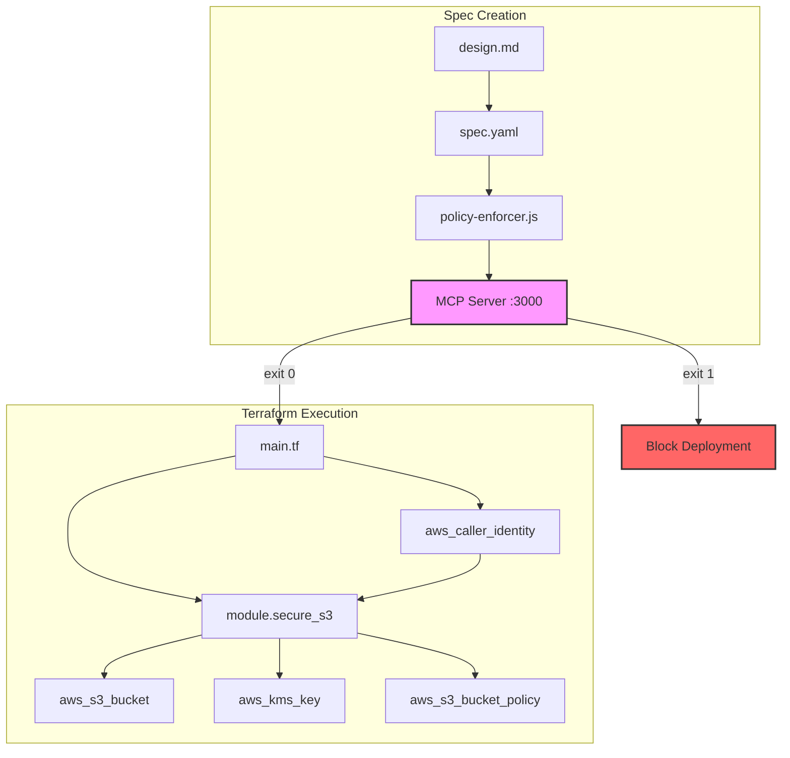

# Design Document: s3-demo-bucket

## Overview

This feature creates a zero-trust compliant S3 bucket for demonstration purposes by instantiating the existing `secure-s3` Terraform module. The design leverages a pre-hardened infrastructure module that implements comprehensive security controls including KMS encryption, public access blocking, TLS enforcement, versioning, and lifecycle management.

The implementation consists of three components:
1. **Terraform Configuration** - Instantiates the secure-s3 module with dynamic bucket naming
2. **ArchSpec YAML** - Declarative specification for policy validation before deployment
3. **Policy Validation Integration** - Automated enforcement of zero-trust rules via MCP server

This approach demonstrates the principle of **secure-by-default infrastructure** where security controls are inherited from vetted modules rather than reimplemented for each resource.

## Architecture

### Component Diagram



### Enforcement Chain

```
spec.yaml → policy-enforcer.js → MCP REST API → validate_iam_policy + check_network_posture
                                                    ↓
                                              exit 0 (pass) / exit 1 (block)
                                                    ↓
                                            Terraform apply (if pass)
```

## Components and Interfaces

### 1. Terraform Configuration (`main.tf`)

**Purpose**: Instantiate the secure-s3 module with dynamic bucket naming based on AWS account ID.

**Structure**:
```hcl
# Data source for dynamic account ID retrieval
data "aws_caller_identity" "current" {}

# Local value for bucket name construction
locals {
  bucket_name = "${data.aws_caller_identity.current.account_id}-zero-trust-demo"
}

# Module instantiation
module "demo_bucket" {
  source = "../../modules/secure-s3"
  
  bucket_name         = local.bucket_name
  allow_force_destroy = true
  
  tags = {
    Environment = "demo"
    Purpose     = "zero-trust-demonstration"
    ManagedBy   = "terraform"
  }
}

# Output exposure
output "bucket_id" {
  description = "Name of the demo S3 bucket"
  value       = module.demo_bucket.bucket_id
}

output "bucket_arn" {
  description = "ARN of the demo S3 bucket"
  value       = module.demo_bucket.bucket_arn
}

output "kms_key_arn" {
  description = "ARN of the KMS key used for bucket encryption"
  value       = module.demo_bucket.kms_key_arn
}
```

**Interface with secure-s3 module**:
- **Input**: `bucket_name` (string), `allow_force_destroy` (bool), `tags` (map)
- **Output**: `bucket_id`, `bucket_arn`, `kms_key_arn`, `bucket_domain_name`

### 2. ArchSpec YAML (`spec.yaml`)

**Purpose**: Declarative specification consumed by the policy enforcer for pre-deployment validation.

**Structure**:
```yaml
name: s3-demo-bucket
version: "1.0"
description: "Zero-trust compliant S3 bucket for demonstration purposes"

resources:
  - type: aws_s3_bucket
    id: demo-bucket
    config:
      bucket_name: "ACCOUNT_ID-zero-trust-demo"
      acl: private
      versioning: true
      server_side_encryption: aws:kms
      public_access_block:
        block_public_acls: true
        block_public_policy: true
        ignore_public_acls: true
        restrict_public_buckets: true
      bucket_policy:
        statements:
          - sid: DenyNonTLS
            effect: Deny
            principal: "*"
            action: "s3:*"
            condition:
              Bool:
                "aws:SecureTransport": "false"
      lifecycle_rules:
        - id: tiered-storage
          status: Enabled
          transitions:
            - days: 30
              storage_class: STANDARD_IA
            - days: 90
              storage_class: GLACIER
          noncurrent_version_expiration:
            days: 90
      
  - type: aws_kms_key
    id: bucket-encryption-key
    config:
      description: "KMS key for S3 bucket encryption"
      enable_key_rotation: true
      deletion_window_in_days: 7
```

**Validation Rules Applied**:
- **NET-004**: S3 ACL must not be `public-read` or `public-read-write` ✓
- **NET-008**: S3 bucket should have VPC endpoint (MEDIUM warning, acceptable for demo)
- **Encryption**: KMS encryption enforced ✓
- **TLS**: Bucket policy denies non-TLS requests ✓

### 3. Policy Enforcer Integration

**Hook Location**: `.kiro/hooks/policy-enforcer.js`

**Execution**:
```bash
node .kiro/hooks/policy-enforcer.js .kiro/specs/s3-demo-bucket/
```

**Validation Flow**:
1. Read `spec.yaml` from the provided folder path
2. POST to `http://localhost:3000/tools/check_network_posture` with ArchSpec body
3. Evaluate violations by severity:
   - **CRITICAL/HIGH**: Exit 1 (block deployment)
   - **MEDIUM/LOW**: Log only (allow deployment)
4. Return exit code to caller

**Expected Result**: Exit 0 (all CRITICAL/HIGH rules pass)

## Data Models

### Bucket Naming Convention

**Format**: `<AWS_ACCOUNT_ID>-zero-trust-demo`

**Example**: `123456789012-zero-trust-demo`

**Rationale**:
- Global uniqueness guaranteed by AWS account ID prefix
- Traceability to owning account
- Consistent naming pattern for demo resources

### Security Controls (Inherited from secure-s3 Module)

| Control | Implementation | Requirement |
|---------|---------------|-------------|
| Encryption at Rest | KMS with automatic key rotation | Req 3.1, 3.2, 3.3 |
| Public Access Block | All four settings enabled | Req 4.1-4.4 |
| Transport Security | Bucket policy denies non-TLS | Req 5.1, 5.2 |
| Versioning | Enabled | Req 6.1, 6.2 |
| Lifecycle Management | 30d → IA, 90d → Glacier | Req 9.1-9.3 |

### Module Outputs

```hcl
output "bucket_id" {
  description = "Name of the S3 bucket"
  value       = string
}

output "bucket_arn" {
  description = "ARN of the S3 bucket"
  value       = string  # Format: arn:aws:s3:::bucket-name
}

output "kms_key_arn" {
  description = "ARN of the KMS key used for bucket encryption"
  value       = string  # Format: arn:aws:kms:region:account:key/key-id
}
```

## Error Handling

### Policy Validation Failures

**Scenario**: spec.yaml contains CRITICAL or HIGH severity violations

**Handling**:
```bash
# Policy enforcer returns exit 1
$ node .kiro/hooks/policy-enforcer.js .kiro/specs/s3-demo-bucket/
❌ CRITICAL violations found:
  - NET-004: S3 bucket has public ACL (public-read)
  
Deployment blocked. Fix violations and re-run validation.
```

**Resolution**: Modify spec.yaml to address violations, re-run enforcer

### MCP Server Unreachable

**Scenario**: `http://localhost:3000` is not responding

**Handling**:
- **Enforce mode**: Exit 1 (fail closed)
- **Dry-run mode**: Log warning, exit 0

**Resolution**:
```bash
# Start MCP server
cd mcp-server && npm run build && node dist/index.js

# Verify health
curl http://localhost:3000/health
```

### Terraform Validation Errors

**Scenario**: Module path incorrect or variables missing

**Handling**:
```bash
# Validate before apply
terraform init -backend=false
terraform validate

# Expected output
Success! The configuration is valid.
```

**Common Errors**:
- Module not found: Verify relative path `../../modules/secure-s3`
- Missing required variable: Ensure `bucket_name` is provided
- Invalid bucket name: Must be DNS-compliant (lowercase, no underscores)

### AWS API Errors

**Scenario**: Bucket name already exists globally

**Error**:
```
Error: creating S3 Bucket: BucketAlreadyExists: The requested bucket name is not available
```

**Resolution**: Bucket names are globally unique. If `<account-id>-zero-trust-demo` exists, append a suffix:
```hcl
locals {
  bucket_name = "${data.aws_caller_identity.current.account_id}-zero-trust-demo-v2"
}
```

## Testing Strategy

### 1. Snapshot Testing

**Purpose**: Verify Terraform configuration generates expected resources

**Approach**:
```bash
# Generate plan output
terraform init -backend=false
terraform plan -out=tfplan

# Convert to JSON for inspection
terraform show -json tfplan > plan.json

# Verify expected resources
jq '.resource_changes[] | select(.type == "aws_s3_bucket")' plan.json
```

**Assertions**:
- S3 bucket resource exists with correct name pattern
- KMS key resource exists with rotation enabled
- Bucket policy resource exists with TLS enforcement
- Public access block resource exists with all settings true
- Versioning resource exists with status "Enabled"

### 2. Policy Validation Testing

**Purpose**: Ensure spec.yaml passes zero-trust rules

**Test Cases**:

| Test Case | Spec Modification | Expected Result |
|-----------|-------------------|-----------------|
| Baseline | Unmodified spec.yaml | Exit 0 |
| Public ACL | Change `acl: public-read` | Exit 1, NET-004 CRITICAL |
| No Encryption | Remove `server_side_encryption` | Exit 1, encryption violation |
| No TLS Policy | Remove DenyNonTLS statement | Exit 1, TLS violation |
| No Versioning | Set `versioning: false` | Exit 1, versioning violation |

**Execution**:
```bash
# Test baseline
node .kiro/hooks/policy-enforcer.js .kiro/specs/s3-demo-bucket/
echo $?  # Should be 0

# Test public ACL violation
# (modify spec.yaml temporarily)
node .kiro/hooks/policy-enforcer.js .kiro/specs/s3-demo-bucket/
echo $?  # Should be 1
```

### 3. Module Integration Testing

**Purpose**: Verify secure-s3 module instantiation works correctly

**Approach**:
```bash
# Navigate to module
cd terraform/modules/secure-s3

# Initialize and validate
terraform init -backend=false
terraform validate

# Expected output
Success! The configuration is valid.
```

**Assertions**:
- Module has no syntax errors
- All required variables are defined
- All outputs are properly exposed

### 4. End-to-End Deployment Testing

**Purpose**: Verify complete workflow from spec to deployed resource

**Steps**:
1. Create spec.yaml in `.kiro/specs/s3-demo-bucket/`
2. Run policy enforcer: `node .kiro/hooks/policy-enforcer.js .kiro/specs/s3-demo-bucket/`
3. Verify exit 0
4. Create main.tf with module instantiation
5. Run `terraform init && terraform plan`
6. Verify plan shows expected resources
7. Run `terraform apply` (in test account only)
8. Verify bucket exists: `aws s3 ls | grep zero-trust-demo`
9. Verify encryption: `aws s3api get-bucket-encryption --bucket <bucket-name>`
10. Verify public access block: `aws s3api get-public-access-block --bucket <bucket-name>`
11. Clean up: `terraform destroy`

**Success Criteria**:
- All commands exit 0
- Bucket created with correct name pattern
- All security controls verified via AWS CLI
- No manual configuration required

### 5. Dry-Run Mode Testing

**Purpose**: Verify policy enforcer respects dry-run flag

**Execution**:
```bash
# Modify spec.yaml to introduce CRITICAL violation
# (e.g., acl: public-read)

# Run in dry-run mode
POLICY_ENFORCER_DRY_RUN=true node .kiro/hooks/policy-enforcer.js .kiro/specs/s3-demo-bucket/
echo $?  # Should be 0 (logged but not blocked)

# Run in enforce mode
node .kiro/hooks/policy-enforcer.js .kiro/specs/s3-demo-bucket/
echo $?  # Should be 1 (blocked)
```

### Why Property-Based Testing Does NOT Apply

This feature is **Infrastructure as Code (IaC)** using Terraform to declare AWS resources. Property-based testing is inappropriate because:

1. **No pure functions**: Terraform configurations are declarative, not functional transformations
2. **No meaningful input variation**: The bucket configuration is fixed; there's no input space to explore
3. **Side-effect only**: The "output" is AWS API calls that create resources, not return values to assert on
4. **Deterministic validation**: Policy rules are boolean checks (encryption on/off, public access yes/no), not properties that hold across input ranges

**Appropriate testing strategies**:
- **Snapshot tests**: Verify `terraform plan` output matches expected resource definitions
- **Policy validation**: Automated checks via MCP server (already implemented)
- **Integration tests**: Deploy to test account, verify via AWS CLI, destroy
- **Schema validation**: Ensure spec.yaml conforms to ArchSpec format

### Test Execution Summary

```bash
# 1. Policy validation
node .kiro/hooks/policy-enforcer.js .kiro/specs/s3-demo-bucket/

# 2. Terraform validation
cd terraform/modules/secure-s3
terraform init -backend=false && terraform validate

# 3. Plan snapshot
terraform plan -out=tfplan
terraform show -json tfplan > plan.json

# 4. Integration test (test account only)
terraform apply -auto-approve
aws s3api get-bucket-encryption --bucket $(terraform output -raw bucket_id)
terraform destroy -auto-approve
```

## Implementation Notes

### File Structure

```
.kiro/specs/s3-demo-bucket/
├── .config.kiro          # Workflow metadata
├── requirements.md       # Feature requirements (already exists)
├── design.md            # This document
├── spec.yaml            # ArchSpec for policy validation
└── tasks.md             # Implementation tasks (to be created)

terraform/examples/s3-demo-bucket/
├── main.tf              # Module instantiation
├── outputs.tf           # Output exposure
└── versions.tf          # Provider requirements
```

### Deployment Workflow

1. **Spec Creation**: Write spec.yaml based on design
2. **Policy Validation**: Run enforcer, verify exit 0
3. **Terraform Init**: `terraform init` to download providers
4. **Terraform Plan**: Review planned changes
5. **Terraform Apply**: Deploy to AWS (test account first)
6. **Verification**: Use AWS CLI to verify security controls
7. **Output Capture**: Save bucket ARN for downstream use

### Security Considerations

- **Demo vs Production**: `allow_force_destroy = true` is set for demo purposes. In production, this should be `false` to prevent accidental data loss.
- **KMS Key Management**: Module creates a new KMS key by default. For production, consider using a centralized KMS key with `kms_key_id` variable.
- **Logging**: Module supports S3 access logging via `logging_bucket_id` variable. Not configured in demo to avoid circular dependencies.
- **VPC Endpoint**: NET-008 will trigger a MEDIUM warning (no VPC endpoint). Acceptable for demo; production should include VPC endpoint for private access.

### Cost Considerations

- **S3 Storage**: Pay for stored objects only (demo likely < $0.01/month)
- **KMS**: $1/month per key + $0.03 per 10,000 requests
- **Lifecycle Transitions**: No additional cost for transitions to IA/Glacier
- **Versioning**: Stores all versions; delete old versions to reduce costs

### Maintenance

- **Module Updates**: When secure-s3 module is updated, re-run `terraform plan` to see changes
- **Policy Updates**: When MCP server rules change, re-run enforcer to verify continued compliance
- **AWS Provider Updates**: Pin provider version in `versions.tf` to avoid breaking changes

## ArchSpec YAML

```yaml
name: s3-demo-bucket
version: "1.0"
description: "Zero-trust compliant S3 bucket for demonstration purposes"

resources:
  - type: aws_s3_bucket
    id: demo-bucket
    config:
      bucket_name: "ACCOUNT_ID-zero-trust-demo"
      acl: private
      versioning: true
      server_side_encryption: aws:kms
      public_access_block:
        block_public_acls: true
        block_public_policy: true
        ignore_public_acls: true
        restrict_public_buckets: true
      bucket_policy:
        statements:
          - sid: DenyNonTLS
            effect: Deny
            principal: "*"
            action: "s3:*"
            condition:
              Bool:
                "aws:SecureTransport": "false"
      lifecycle_rules:
        - id: tiered-storage
          status: Enabled
          transitions:
            - days: 30
              storage_class: STANDARD_IA
            - days: 90
              storage_class: GLACIER
          noncurrent_version_expiration:
            days: 90
      
  - type: aws_kms_key
    id: bucket-encryption-key
    config:
      description: "KMS key for S3 bucket encryption"
      enable_key_rotation: true
      deletion_window_in_days: 7
```
